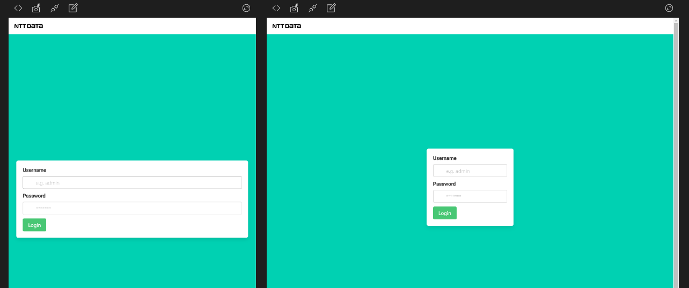
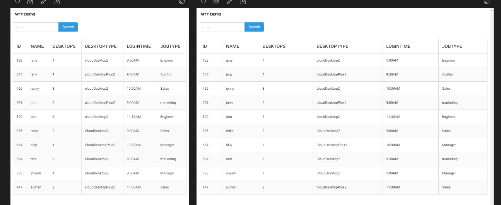
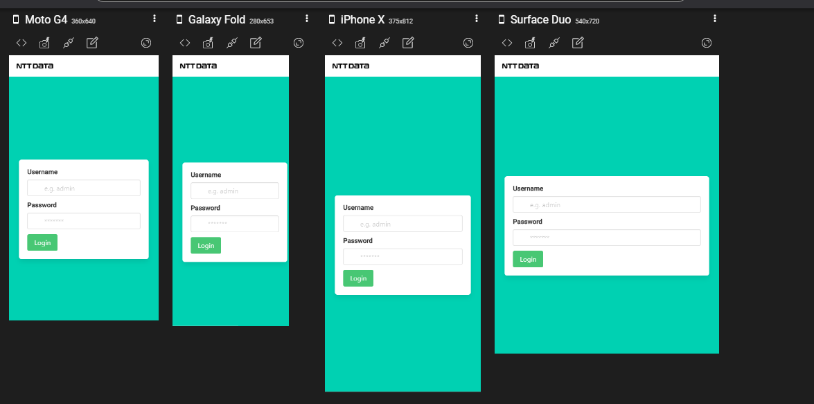
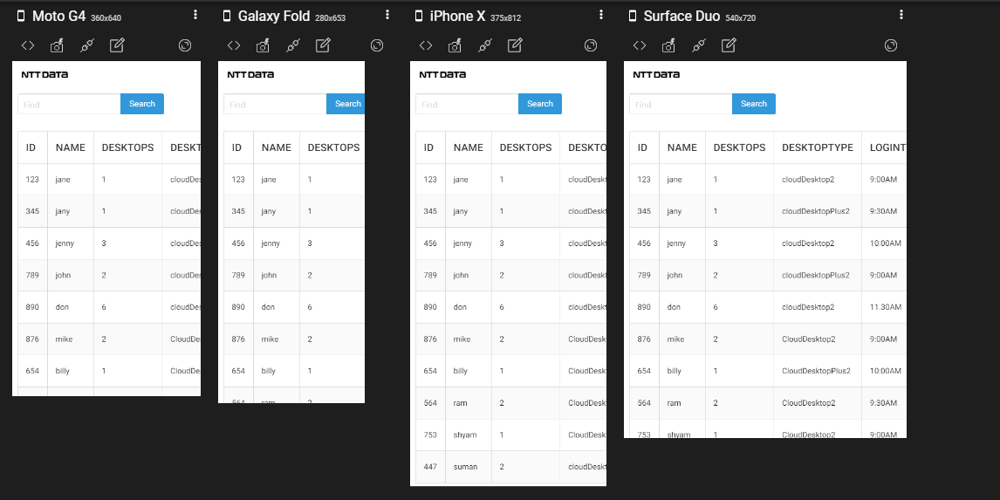
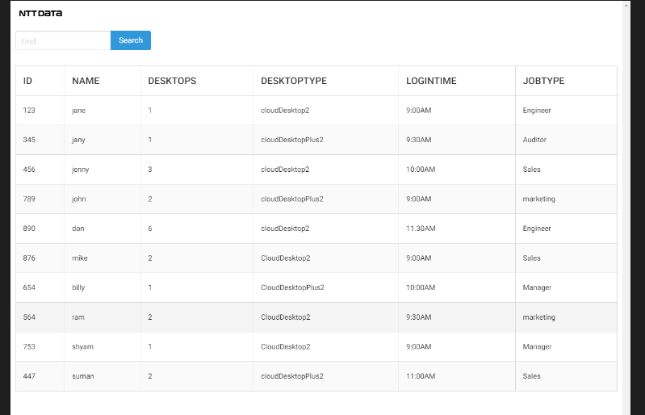

# NTT Data Coding Assigment

Assignment Criteria :

1. You have a sheet with user data with their login times and other details.
2. The task is to prepare a small webApp with two pages:
3. Login page: where user can login with a password
4. dashboard: after logging in, user can see all the relevant data from the sheet on the dashboard. the dashboard should also contain a search bar to search for other users.
5. The dashboard should be easily navigable and clear.
6. You can prepare this using any tech stack.
7. Try to be imaginative with the webApp and try including animation and graph wherever possible.

## Tech Stack used for fast prototype

- Angular Framework
- CSS styling - Bulma for responsive design

## Development server

Angular frontend :`ng serve` to run in localhost 4200

## Build

Run `ng build my-app` to build the project. The build artifacts will be stored in the `dist/` directory. Use the `--prod` flag for a production build.

## Application Snapshot on all devices

Application is made responsive so it can be used in all devices

###### Wider Screens (Tablet, Desktop)

###### Smaller Screens( Mobile Devices)

## Docker File

Created docker file for hosting it in a container (nttData.dockerfile)

commands to create image of those docker files

> docker image build -t nttdataassignmnet -f nttData.dockerfile ./

## Assignment Acceptance Criteria

The task is to prepare a small webApp with two pages:

- Login page
- Data Viewing page

Login page: where user can login with a password

- default username : admin
- default password : admin

dashboard: after logging in, user can see all the relevant data from the sheet on the dashboard. the dashboard should also contain a search bar to search for other users.

Search bar : global search bar which searches all the elements from the table

The dashboard should be easily navigable and clear

- Dashboard is added inside the container hence it is easily navigable

Try to be imaginative with the webApp and try including animation and graph wherever possible

- Still not achieved will update for next update.
